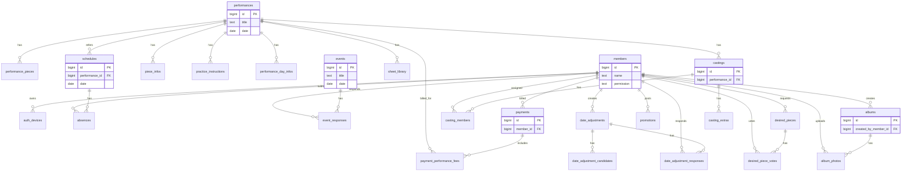

# PostgreSQL テーブルレイアウト

最終更新: 2026-07-06
参照DDL: PostgreSQL schema（本番DBへ適用済み）

## 1. レイアウト方針

- 現行JSONコレクションを正規化し、参照整合性をFKで担保する。
- バイナリ本体はGCS管理のまま維持し、DBにはメタデータのみを保持する。
- UI都合の文字列キャッシュ列（例: performance_title, member_name）は、移行初期の互換性を優先して保持する。

## 2. テーブル群

- Core master: performances, performance_pieces, schedules, announcements, events, members, auth_devices
- Extra collections: absences, event_responses, date_adjustments, date_adjustment_candidates, date_adjustment_responses, piece_infos, practice_instructions, performance_day_infos, castings, casting_members, casting_extras, payments, payment_performance_fees, desired_pieces, desired_piece_votes, promotions, albums, album_photos
- Settings: part_settings, venue_settings, flyer_distributions, flyer_distribution_assignments, org_settings, sns_settings, connection_settings
- File metadata: drive_files, recording_metadata, sheet_library

## 3. ERレイアウト（主要リレーション）

## 4. 参照整合性ルール

- 親削除時に子を消す関係は `ON DELETE CASCADE` を採用。
  - 例: performances -> performance_pieces, castings
  - 例: albums -> album_photos
- 履歴を残したい関係は `ON DELETE SET NULL` を採用。
  - 例: members -> payments, members -> promotions
- 中間テーブル `payment_performance_fees` は複合主キー `(payment_id, performance_id)` を採用。

## 4.1 起動時互換補完

- `ensure_db_schema_compatibility` は、管理者メニューの保存に必要なDB-backed collectionテーブルと列を `DB_COLLECTION_COLUMNS` / `DB_CHILD_COLUMNS` から補完する。
- 既存DBへの安全な追補を目的とし、`CREATE TABLE IF NOT EXISTS` と `ALTER TABLE ... ADD COLUMN IF NOT EXISTS` を使う。
- 正式なDDL履歴は `db/migrations/` を優先し、互換補完はマイグレーション未適用・途中移行DBで保存APIが落ちることを防ぐための保険とする。

## 5. 命名・監査カラム

- 主キー: 原則 `id BIGINT GENERATED BY DEFAULT AS IDENTITY`
- 監査カラム: 原則 `created_at`, `updated_at` を持つ
- インデックス: FK列・日付列・検索キー列（name/object_name等）に付与
